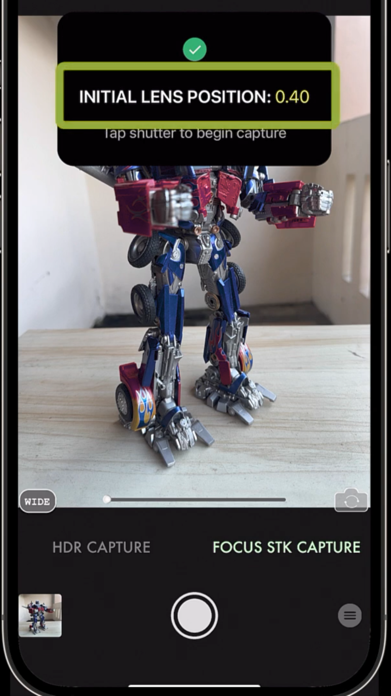
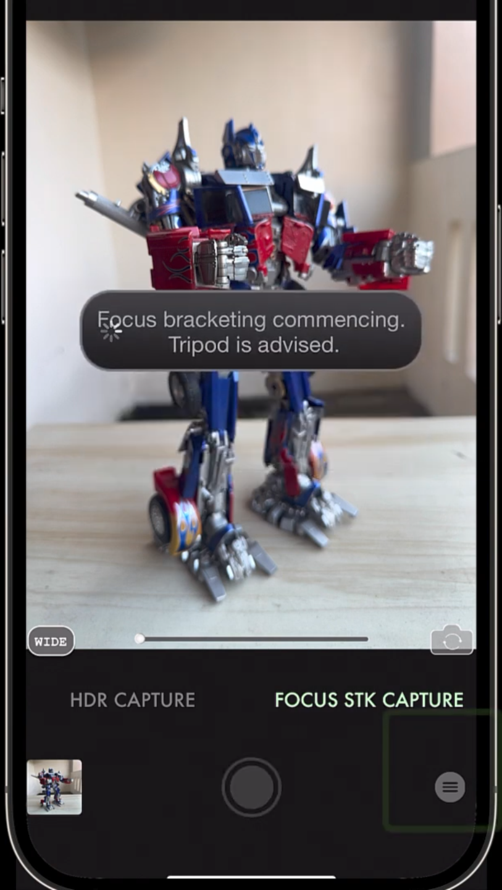
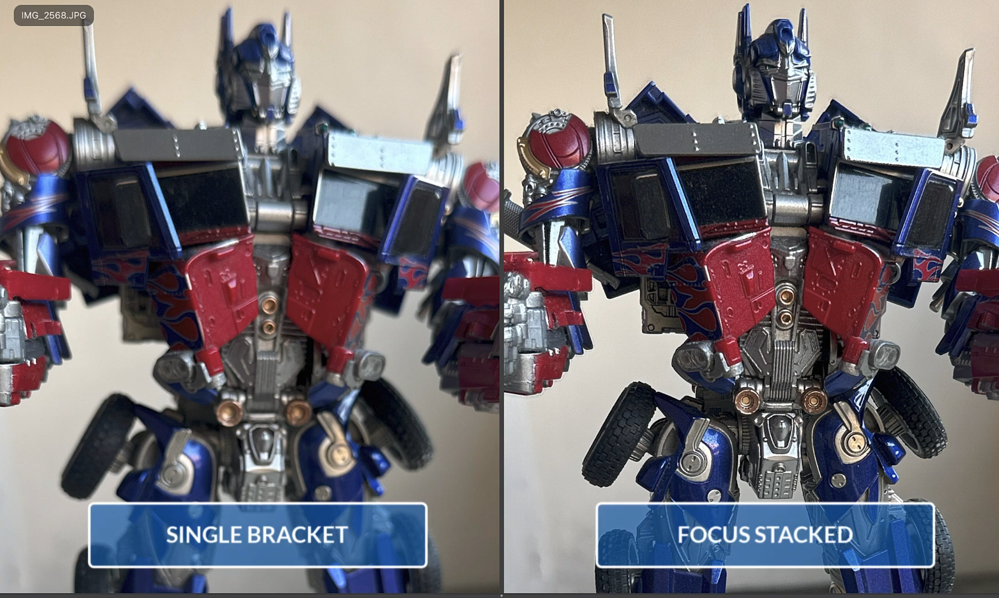
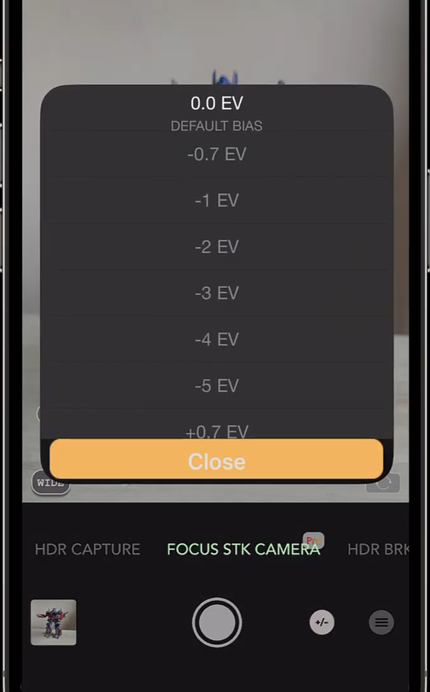
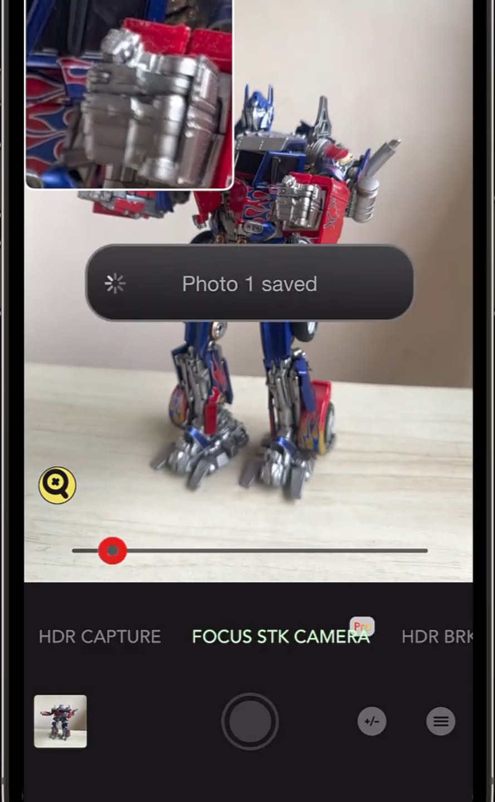

# Глава 1. Аналитический обзор предметной области вычислительной фотографии и методов искусственного интеллекта, применяемых в задаче автоматизированного фокус-стекинга

## 1.1. Анализ предметной области и постановка научно-технической проблемы

### 1.1.1. Предметная область: вычислительная фотография и компьютерное зрение на мобильных устройствах

Предметной областью настоящей работы является **вычислительная фотография (computational photography)** — направление на стыке цифровой обработки изображений, компьютерного зрения (Computer Vision, CV) и машинного обучения, в рамках которого алгоритмические методы используются для преодоления фундаментальных физических ограничений оптических систем [1, 2]. Современные смартфоны являются основной платформой развёртывания таких алгоритмов: ограниченные размеры сенсора и объектива компенсируются программной обработкой — HDR, ночными режимами, портретным размытием, мультикадровым шумоподавлением, super-resolution и фокус-стекингом [2, 3].

Конкретная задача, решаемая в данной работе, — **автоматический фокус-стекинг с детекцией объектов** (object-aware focus stacking). Фокус-стекинг (focus stacking, focal plane merging) — это техника получения изображения с расширенной глубиной резкости (Extended Depth of Field, EDoF) путём программной комбинации серии снимков, сделанных с различными плоскостями фокусировки [4, 5].

# История развития

История развития фокус-стекинга (focus stacking) — это путь от сложнейших научных методов микроскопии до автоматизированной функции, доступной в современных смартфонах и фотоаппаратах. Данная технология, также известная как z-стекинг или слияние плоскостей фокуса, изначально создавалась для преодоления физического ограничения оптики — критически малой глубины резкости (ГРИП) при сильном увеличении. [1, 2, 3] 
Ниже приведены ключевые этапы эволюции этой технологии.
------------------------------
## 1. Истоки в науке и микроскопии (1960-е – 1980-е годы)
До появления цифровой фотографии первыми с проблемой микроскопической ГРИП столкнулись ученые-биологи и материаловеды. При работе с оптическими микроскопами на больших увеличениях в фокусе оказывался лишь тончайший срез объекта. [4] 

* Первые эксперименты: В 1960–1970-х годах исследователи пытались вручную совмещать резкие зоны. Для этого делалась серия снимков на фотопленку с микрошагом фокусировочного винта микроскопа, после чего ученые вручную перерисовывали или пытались комбинировать участки в фотолаборатории.
* Появление аналоговых систем: В 1980-х годах начали создаваться первые специализированные и крайне дорогие оптико-механические комплексы для научных лабораторий. Они позволяли частично автоматизировать процесс съемки слоев, но обработка результатов все еще оставалась сложной. [5] 

## 2. Цифровая революция и первый софт (1990-е – середина 2000-х)
С появлением доступных персональных компьютеров и ПЗС-матриц (CCD) процесс объединения снимков переместился в цифровую среду, что дало мощный толчок развитию алгоритмов.

* Вклад микробиологии: Одними из первых алгоритмы цифрового z-стекинга начали применять разработчики программного обеспечения для научных микроскопов в 1990-х годах.
* Появление специализированного ПО (2005–2006 гг.): Именно в этот период стекинг вышел за пределы лабораторий и стал доступен фотографам-энтузиастам. Появились легендарные специализированные программы, такие как Helicon Focus и Zerene Stacker, а также бесплатная утилита CombineZ. Компьютерные алгоритмы научились анализировать микроконтраст пикселей, определять самые резкие зоны на каждом кадре и бесшовно сшивать их в один снимок. [5] 

## 3. Появление макрорельсов и развитие ручного стекинга (2000-е – 2010-е)
Технологию начали массово внедрять в коммерческую, макро- и ювелирную фотографию. Однако процесс съемки все еще требовал усилий. [6, 7] 

* Макрорельсы: Поскольку точно сдвигать кольцо фокусировки объектива руками на доли миллиметра тяжело, индустрия ответила созданием ручных, а затем и автоматизированных электронных макрорельсов (например, Cognisys StackShot или WeMacro). Шаговый мотор плавно двигал камеру по рельсе, а синхронизированный пульт делал кадры.
* Графические редакторы: В 2007 году компания Adobe добавила функции автоматического выравнивания и смешивания слоев (Auto-Align Layers и Auto-Blend Layers) в Adobe Photoshop CS3, сделав технологию частью стандартного рабочего процесса профессиональных фотографов. [8] 

## 4. Встроенный брекетинг и внутрикамерный стекинг (2010-е – настоящее время)
Главным прорывом последних лет стал перенос всего процесса из компьютера прямо в корпус съемочного оборудования. [9] 

* Брекетинг фокусировки (Focus Bracketing): Производители камер начали встраивать функцию автоматического изменения фокуса при серийной съемке. Камера сама делает, к примеру, 50 кадров за секунду, используя микромотор объектива для смещения дистанции фокусировки. Пионерами здесь стали беззеркальные камеры систем Micro 4/3 (Olympus и Panasonic), а затем функцию переняли Fujifilm, Canon, Nikon и Sony.
* Внутрикамерный стекинг: Камеры научились не просто снимать серию (брекетинг), но и мгновенно сшивать готовый резкий JPEG-файл силами своего процессора за долю секунды.
* Эра вычислительной фотографии (Computational Photography): Сегодня фокус-стекинг незаметно для пользователя работает во многих смартфонах (особенно при переключении в макрорежим). Смартфон делает серию быстрых кадров и использует нейросети для сборки идеально резкого изображения, обходя физические ограничения крошечных мобильных сенсоров. [2, 10, 11] 

Стекинг используется даже в космических миссиях — например, марсоход Curiosity применяет этот метод для съемки текстуры марсианских скал ручным объективом-микроскопом MAHLI. [12] 
------------------------------

[1] [https://ru.wikipedia.org](https://ru.wikipedia.org/wiki/%D0%A4%D0%BE%D0%BA%D1%83%D1%81-%D1%81%D1%82%D0%B5%D0%BA%D0%B8%D0%BD%D0%B3)
[2] [https://www.scribd.com](https://www.scribd.com/document/834097393/The-History-and-Evolution-of-Digital-Photography)
[3] [https://gurfoto.ru](https://gurfoto.ru/blog/focusstacking/)
[4] [https://shrean.medium.com](https://shrean.medium.com/focused-and-unfocused-a-beginners-comparison-of-focus-stacking-db587fb33c9e)
[5] [https://www.macrosmuymacros.com](https://www.macrosmuymacros.com/en/contents/what-is-focus-stacking)
[6] [https://www.fotosklad.ru](https://www.fotosklad.ru/expert/articles/fokus-steking-v-fotografii-cto-eto-zacem-nuzen-i-kak-ego-delat/)
[7] [https://ruphoto.ru](https://ruphoto.ru/master/fokus-steking)
[8] [https://www.researchgate.net](https://www.researchgate.net/publication/365837835_A_Fast_and_Cost-Effective_FACE_Instrument_Setting_to_Construct_Focus-Extended_Images)
[9] [https://www.canon-europe.com](https://www.canon-europe.com/get-inspired/tips-and-techniques/focus-stacking-beginners/)
[10] [https://learnandsupport.getolympus.com](https://translate.google.com/translate?u=https://learnandsupport.getolympus.com/learn-center/photography-tips/landscapes-nature/using-focus-bracketing-and-stacking-in-landscape&hl=ru&sl=en&tl=ru&client=sge)
[11] [https://cam.start.canon](https://cam.start.canon/ru/C013/manual/html/UG-04_Shooting-1_0340.html)
[12] [https://en.wikipedia.org](https://en.wikipedia.org/wiki/Focus_stacking)

### 1.1.2. Физическое обоснование проблемы

Глубина резко изображаемого пространства (Depth of Field, DoF) ограничена законами геометрической оптики и определяется выражением [6]:

$$
DoF \approx \frac{2 N c f^2 s^2}{f^4 - N^2 c^2 s^2}
$$

где $N$ — число диафрагмы, $c$ — диаметр кружка нерезкости, $f$ — фокусное расстояние, $s$ — дистанция фокусировки. При макросъёмке и съёмке близких объектов DoF может составлять менее одного сантиметра, что делает невозможным одновременное получение резкого изображения нескольких объектов, расположенных на разных расстояниях. На мобильных устройствах ситуация осложняется фиксированной (или ограниченно регулируемой) диафрагмой, что лишает фотографа классического инструмента — закрытия диафрагмы для увеличения DoF.

Алгоритмическое решение заключается в построении изображения с расширенной DoF по серии $\{I_1, I_2, \ldots, I_N\}$ снимков, в которых сфокусирован один из объектов сцены, путём поточечного выбора наиболее резкого пикселя [4]:

$$
I_{final}(x,y) = I_{k^*}(x,y), \quad k^* = \arg\max_{i} S_i(x,y),
$$

где $S_i(x,y)$ — некоторая мера локальной резкости в окрестности пикселя $(x,y)$ кадра $I_i$.

### 1.1.3. «Узкие места» существующих решений

### AuraHDR Camera
AuraHDR Camera создана исключительно для устройств Apple (iOS / iPadOS). Версии для Android у этого разработчика нет. Приложение использует закрытые низкоуровневые API-инструменты Apple для одновременного контроля фокуса и работы с фирменным форматом ProRAW.

Оно полностью закрывает весь цикл «всё в одном»: встроенный движок вычислительной фотографии позволяет автоматически снять серию кадров с разным фокусом (до 100 снимков в сессии) и тут же склеить их в один готовый резкий файл прямо на iPhone. 
## Как работает режим фокус-стекинга в AuraHDR Camera:

   1. Наведение: Вы запускаете приложение, переходите в режим фокус-стекинга и просто тапаете по ближайшей к вам точке объекта. Можно отметить несколько точек вручную.
   
   2. Съемка: Приложение самостоятельно делает серию кадров (работает встроенный 100-кадровый движок брекетинга), на лету смещая фокус вглубь сцены. Каждый кадр снимается примерно за 0.8 секунды.
   
   3. Результат: Процессор iPhone склеивает кадры. На выходе в вашу галерею сохраняются два файла: обычный снимок (для сравнения) и финальное полностью резкое изображение. 

### ручной режим
для съемки областей с низкой контрастностью или настраиваемой автоматизации есть режим задания количества кадров и расстояния переноса фокуса вручную. Камера делает от 2 до 7 снимков с заданной экспозицией, перенося фокус глубже.

## Важные нюансы при работе «все в одном» на смартфоне:

* Вычислительная нагрузка: Процесс склейки 48-мегапиксельных RAW/ProRAW кадров силами мобильного процессора — это тяжелая математическая задача. Склейка на телефоне займет заметно больше времени, чем на мощном ПК.
* Требование к стабилизации: Поскольку камера делает длинную серию снимков, использование штатива строго обязательно. Если телефон качнётся в руках во время съёмки, алгоритм выдаст смазанные «артефакты» на стыках слоёв.
* Ограничение по объективам: Разработчики приложения отмечают, что автоматический режим оптимизирован для работы в первую очередь с основным (широкоугольным) объективом iPhone. 

Если вы хотите получить коммерческое качество макросъемки (например, для ювелирных изделий), раздельный метод (съемка на iPhone через CameraPixels PRO + склейка на ПК в Helicon Focus) все еще дает более чистый и контролируемый результат. Но для быстрых творческих или предметных кадров без компьютера AuraHDR на данный момент — лучшее решение. [3, 4, 5] 
Если хотите, мы можем подробно разобрать:

* Как правильно выставить свет для мобильного макро, чтобы убрать тени?
* Нужны ли для вашего iPhone дополнительные макро-линзы (например, Moment или ShiftCam)?

[3] [https://www.facebook.com](https://www.facebook.com/groups/iphonephototipstricks/posts/2177910942638248/)
[4] [https://camerapixels.app](https://camerapixels.app/2020/04/14/focus-stacking-for-macro-photography/)
[5] [https://forum.mrhmag.com](https://forum.mrhmag.com/post/focus-stacking-on-the-cheap-12216720)

Анализ существующих решений в области фокус-стекинга (Helicon Focus, Zerene Stacker, Adobe Photoshop Auto-Blend Layers, открытые библиотеки enfuse/align_image_stack из пакета Hugin) позволяет выделить следующие проблемные аспекты [4, 5, 7]:

**1. Ручной выбор плоскостей фокусировки.** Классические инструменты предполагают наличие готовой серии снимков, сделанной фотографом вручную или с помощью контроллера focus rail. Автоматизированный выбор содержательно значимых плоскостей фокуса (по объектам сцены, а не по равномерной развёртке) практически не реализован в массовых продуктах.

**2. Высокие вычислительные затраты.** Per-pixel операции (вычисление карты резкости, построение карты-«источника», бесшовная склейка) в наивной реализации имеют сложность $O(N \cdot W \cdot H)$ и выполняются медленно на больших изображениях (например, 12 Мпикс). На мобильных устройствах это особенно критично из-за ограниченной памяти и тепловых ограничений процессора.

**3. Артефакты выравнивания и «двоения».** Между кадрами проходит время, достаточное для дрожания камеры и движения объектов; одной проективной гомографии часто недостаточно из-за эффекта focus breathing — изменения поля зрения при перефокусировке [8]. Это приводит к ghosting-артефактам, которые требуют либо более сложных моделей деформации (thin-plate spline, оптический поток), либо постобработки.

**4. Отсутствие «семантической» осведомлённости.** Существующие алгоритмы оперируют исключительно низкоуровневыми признаками резкости, не «понимая», какие пиксели принадлежат одному объекту. Это приводит к ситуациям, когда один объект разбивается между несколькими источниками: часть пикселей берётся из кадра $I_i$, часть — из $I_j$, что создаёт визуально неприятные переходы внутри объекта.

**5. Проблемы конфиденциальности при облачной обработке.** Перенос обработки на удалённый сервер снижает требования к ресурсам устройства, но создаёт риск утечки персональных данных пользователя; локальная (on-device) обработка предпочтительнее с точки зрения GDPR-совместимости [9].

**6. Низкая объяснимость решений.** Финальное изображение не сопровождается информацией о том, из какого кадра взят тот или иной фрагмент, что затрудняет отладку и контроль качества.

### 1.1.4. Постановка научно-технической проблемы

С учётом перечисленных ограничений сформулирована следующая научно-техническая проблема: **разработать программную систему автоматического фокус-стекинга для мобильной платформы Android, которая сочетает (а) автоматическую детекцию объектов сцены для определения плоскостей фокусировки, (б) робастный алгоритм геометрического выравнивания серии снимков, (в) объектно-ориентированное построение карты-«источника» и бесшовную склейку, (г) гибридный режим работы (on-device / удалённый сервер) с приоритетом локальной обработки, (д) воспроизводимость и отлаживаемость пайплайна за счёт сохранения промежуточных артефактов**.

## 1.2. Обзор современных подходов к решению задач компьютерного зрения и инструментов промышленной разработки систем ИИ

### 1.2.1. Классификация методов детекции объектов

Детекция объектов (object detection) — задача одновременной локализации и классификации объектов в изображении — является классической задачей CV [10]. Современные методы можно классифицировать следующим образом:

**Классические методы (до 2012 г.):** скользящее окно + признаки HOG/SIFT + классификатор SVM (детектор Viola–Jones, Dalal–Triggs) [11]. Применимость ограничена жёсткими классами объектов; уступают глубоким нейросетям по точности.

**Двухстадийные нейросетевые детекторы:** R-CNN, Fast R-CNN, Faster R-CNN, Mask R-CNN [12, 13]. Сначала генерируются регионы-кандидаты (Region Proposals), затем выполняется их классификация. Высокая точность (mAP), но низкая скорость.

**Одностадийные детекторы (single-shot):** SSD, YOLO (You Only Look Once) различных версий — v3, v4, v5, v8, v10, v11; RetinaNet [14, 15]. Регрессия bounding boxes и классификация выполняются за один проход сети. Оптимальный компромисс «скорость–точность» для мобильных и встраиваемых систем.

**Трансформерные архитектуры:** DETR, Deformable DETR, RT-DETR [16, 17]. Используют механизм внимания и устраняют необходимость в Non-Maximum Suppression. Показывают SOTA-результаты, но требуют больше вычислительных ресурсов.

В настоящей работе используются два альтернативных детектора:

1. **Google ML Kit Object Detection** [18] — закрытое мобильное решение Google, оптимизированное для on-device инференса (поддержка NNAPI/GPU-делегатов); работает в режимах `STREAM_MODE` (для real-time preview) и `SINGLE_IMAGE_MODE` (для съёмки).
2. **YOLOv10/v11 в формате ONNX** [15, 19], запускаемый через OpenCV DNN; используется letterbox-препроцессинг (изменение размера с сохранением пропорций и заполнением до 640×640) и Non-Maximum Suppression (NMS) на этапе постобработки.

Для серверной части используется **YOLOv11-seg** (instance segmentation) — расширение YOLOv11 с дополнительной ветвью предсказания масок, что позволяет получить попиксельные маски объектов и применять «объектную» доработку карты-источника [19].

### 1.2.2. Метрики оценки качества детекции

Стандартными метриками оценки детекторов являются [10, 20]:

- **Precision** (точность) и **Recall** (полнота) — отношения TP / (TP + FP) и TP / (TP + FN);
- **F1-score** — гармоническое среднее Precision и Recall;
- **IoU (Intersection over Union)** — отношение площади пересечения предсказанного и истинного bbox к площади их объединения; используется для определения «правильности» детекции с порогом обычно 0.5;
- **mAP (mean Average Precision)** — площадь под кривой Precision–Recall, усреднённая по классам и порогам IoU (mAP@0.5, mAP@0.5:0.95 в стандарте COCO).

В задачах сегментации добавляются Dice coefficient и pixel accuracy [21].

### 1.2.3. Методы измерения локальной резкости

Ключевым этапом фокус-стекинга является построение карты резкости. Существуют следующие классы метрик [22, 23]:

- **Градиентные методы:** Sobel gradient magnitude, Tenengrad — основаны на сумме квадратов градиентов;
- **Лапласиан-методы:** Laplacian variance, modified Laplacian — реакция на вторую производную;
- **Difference of Gaussians (DoG):** $DoG(x,y) = |G_{\sigma_1} * I - G_{\sigma_2} * I|$, где $\sigma_1 < \sigma_2$, является аппроксимацией Laplacian of Gaussian (LoG) [24];
- **Частотные методы:** энергия высокочастотных компонент DFT/DCT;
- **Wavelet-методы:** энергия высокочастотных вейвлет-коэффициентов.

В настоящей работе используется DoG с последующим **unsharp masking** для усиления отклика:

$$
S = DoG + \alpha \cdot (DoG - G_\sigma * DoG)
$$

Полученная карта бинаризуется по порогу и обрабатывается морфологическими операциями `MORPH_OPEN` и `MORPH_CLOSE` для устранения шума и закрытия отверстий [25].

### 1.2.4. Методы геометрического выравнивания изображений

Для совмещения снимков, снятых с временным интервалом, применяется feature-based registration [26]:

1. **Детекция и описание ключевых точек.** Классические алгоритмы: SIFT [27], SURF [28]. Их недостаток — патентная защита (до недавнего времени) и относительно высокая вычислительная стоимость. Альтернатива — **ORB (Oriented FAST and Rotated BRIEF)** [29] — комбинация детектора FAST и бинарного дескриптора BRIEF; работает на порядок быстрее SIFT при сравнимом качестве на типичных сценах.
2. **Сопоставление дескрипторов.** Brute-Force Matcher с метрикой Хэмминга для бинарных дескрипторов; **Lowe's ratio test** [27] отсеивает неоднозначные соответствия (отношение расстояний до первого и второго ближайших соседей < 0.75).
3. **Робастная оценка геометрической модели.** Алгоритм **RANSAC** [30] устойчиво оценивает гомографию (матрица $H$ размером $3 \times 3$):

$$
\begin{pmatrix} x' \\ y' \\ w' \end{pmatrix} = H \begin{pmatrix} x \\ y \\ 1 \end{pmatrix}
$$

Качество выравнивания оценивается по близости $\det(H)$ к единице и по малости перспективных компонент $H_{20}, H_{21}$.

Альтернативные подходы к выравниванию — оптический поток (Lucas–Kanade [31], Farnebäck [32], DeepFlow), нелинейные деформации (thin-plate spline) — рассматриваются в литературе как развитие классической гомографической схемы.

### 1.2.5. Методы построения карты-«источника» и склейки

После выравнивания решается задача **labeling problem**: для каждого пикселя $(x, y)$ определяется индекс $k(x,y) \in \{1, \ldots, N\}$ — номер исходного кадра. Подходы:

- **Per-pixel argmax** по карте резкости — простейший способ, чувствителен к шуму;
- **Графовая оптимизация (Graph Cuts):** минимизация энергетического функционала с термами data + smoothness, например методом alpha-expansion [33];
- **Pyramid-based blending:** Laplacian pyramid blending по Burt–Adelson [34] — многомасштабная склейка;
- **Distance-transform feathering:** взвешенное смешивание на границах зон с весами, пропорциональными расстоянию до границы соответствующей области [35].

В настоящей работе применяется per-pixel argmax с последующим mode-filter сглаживанием границ, Voronoi-подобное заполнение неcфокусированных областей итеративной дилатацией от focus-точек, distance-transform feather blending в швах и **Navier–Stokes inpainting** (`cv2.inpaint` с флагом `INPAINT_NS`) [36] для заполнения артефактных пикселей. На сервере дополнительно выполняется **YOLO-refinement**: сегментационные маски YOLOv11-seg используются для гарантии того, что пиксели одного объекта присваиваются единственной зоне фокуса (по принципу мажорирования).

### 1.2.6. Сравнительный анализ фреймворков и библиотек

В таблице 1.1 приведено сравнение основных фреймворков и библиотек, релевантных для разработки.

**Таблица 1.1 — Сравнение библиотек, используемых в проекте**

| Библиотека / технология | Версия | Платформа | Назначение в проекте |
|---|---|---|---|
| Android CameraX | 1.6.0 | Android | Унифицированное API для preview, capture, image analysis [37] |
| OpenCV | 4.13.0 | Android / Python | DoG, ORB, RANSAC, warpPerspective, distanceTransform, inpaint [25] |
| Google ML Kit | 17.0.2 | Android | On-device object detection [18] |
| OpenCV DNN | 4.13.0 | Android | Запуск YOLOv10 ONNX |
| Ultralytics | latest | Python / Server | Запуск YOLOv11-seg (PyTorch backend) [19] |
| Flask | latest | Python / Server | REST API сервера |
| NumPy | latest | Python / Server | Векторизованные тензорные операции [38] |

**Альтернативные ML-фреймворки для on-device инференса:**

- **TensorFlow Lite** [39] — Google-флагман для мобильных устройств; поддержка NNAPI, GPU-делегатов, Hexagon DSP;
- **PyTorch Mobile / ExecuTorch** [40] — мобильный рантайм PyTorch;
- **ONNX Runtime Mobile** [41] — кросс-фреймворковый рантайм;
- **MediaPipe** [42] — высокоуровневый фреймворк Google для CV-пайплайнов.

Выбор OpenCV DNN + ML Kit обусловлен (а) уже имеющейся в проекте зависимостью от OpenCV для классических CV-операций, (б) простотой интеграции ML Kit без необходимости поставлять модель в APK.

### 1.2.7. Инструменты MLOps и промышленной разработки

Из перечисленных MLOps-инструментов в настоящем проекте практически задействована только контейнеризация серверного компонента (Docker-готовность); инструменты версионирования данных (DVC), оркестрации экспериментов (MLflow, Airflow) и распределённой обработки (Spark, Dask) выходят за рамки задачи, поскольку проект использует предобученные модели и работает с короткими сериями снимков в реальном времени, а не с массовыми датасетами.

- **Контейнеризация:** Docker — изоляция зависимостей серверного компонента (`gunicorn`, `flask`, `opencv-python-headless`, `ultralytics`), что упрощает развёртывание;
- **Оркестрация:** Docker Compose — достаточное решение для бэкенда на одной машине;

В рамках настоящего проекта серверная часть подготовлена к контейнеризации (наличие `requirements.txt`, выделенный entry-point `app.py`, поддержка `gunicorn`); реализованы базовые элементы наблюдаемости — структурированные логи и сохранение всех промежуточных артефактов (`debug_output/session_<timestamp>/`), что соответствует принципу reproducibility в MLOps.

### 1.2.8. Аппаратное обеспечение

Современные системы CV-инференса используют следующие аппаратные ускорители [52, 53]:

- **NVIDIA CUDA / cuDNN / TensorRT** — стандарт для серверного инференса и обучения;
- **Google TPU** — специализированные ASIC для тензорных операций;
- **Apple Neural Engine, Qualcomm Hexagon DSP, ARM Mali NPU** — мобильные NPU;
- **Android NNAPI** [54] — унифицированный API для делегирования инференса аппаратным ускорителям мобильного устройства.

В настоящем проекте on-device инференс использует возможности ML Kit, который автоматически выбирает оптимальный hardware backend через NNAPI; серверный YOLOv11-seg может запускаться на CUDA-совместимых GPU при их наличии.

### 1.2.9. Обоснование выбора методов и инструментов

На основании проведённого обзора в качестве методологической базы выбраны:

1. **ML Kit Object Detection** — основной детектор (быстрый, on-device, не требует поставки модели);
2. **YOLOv10/v11 ONNX через OpenCV DNN** — резервный детектор;
3. **YOLOv11-seg на сервере** — для объектной доработки карты-источника;
4. **DoG + unsharp masking + морфология** — построение карты резкости;
5. **ORB + BF-Hamming + Lowe ratio test + RANSAC + warpPerspective** — выравнивание (компромисс «скорость–качество», свобода от патентов);
6. **Per-pixel argmax + Voronoi-fill + mode-filter + distance-transform feathering + Navier–Stokes inpainting** — построение карты-источника и склейка;
7. **CameraX** — унифицированное API мобильной камеры;
8. **Гибридная клиент-серверная архитектура** с приоритетом on-device обработки.

Выбор обусловлен сочетанием требований реального времени preview-стадии, ограничений мобильной платформы по вычислительным ресурсам и памяти, а также необходимостью обеспечить воспроизводимость и отлаживаемость пайплайна за счёт сохранения промежуточных артефактов на каждой стадии.

---

## Библиографический список к Главе 1

1. Szeliski R. Computer Vision: Algorithms and Applications. — 2nd ed. — Springer, 2022. — 925 p.
2. Raskar R., Tumblin J. Computational Photography: Mastering New Techniques for Lenses, Lighting, and Sensors. — A K Peters, 2010. — 408 p.
3. Delbracio M., Kelly D., Brown M. S., Milanfar P. Mobile Computational Photography: A Tour // Annual Review of Vision Science. — 2021. — Vol. 7. — P. 571–604.
4. Goldsmith N. T. Deep focus: a digital image processing technique to produce improved focal depth in light microscopy // Image Analysis & Stereology. — 2000. — Vol. 19, № 3. — P. 163–167.
5. Forster B., Van De Ville D., Berent J., Sage D., Unser M. Complex wavelets for extended depth-of-field // Microscopy Research and Technique. — 2004. — Vol. 65, № 1–2. — P. 33–42.
6. Ray S. F. Applied Photographic Optics. — 3rd ed. — Focal Press, 2002. — 656 p.
7. Hugin Project. enfuse / align_image_stack documentation. URL: https://hugin.sourceforge.io/ (дата обращения: 2025).
8. Wronski B., Garcia-Dorado I., Ernst M. et al. Handheld Multi-Frame Super-Resolution // ACM Transactions on Graphics. — 2019. — Vol. 38, № 4. — Art. 28.
9. European Parliament. Regulation (EU) 2016/679 (GDPR). — Official Journal of the European Union, 2016.
10. Zou Z., Chen K., Shi Z., Guo Y., Ye J. Object Detection in 20 Years: A Survey // Proceedings of the IEEE. — 2023. — Vol. 111, № 3. — P. 257–276.
11. Dalal N., Triggs B. Histograms of Oriented Gradients for Human Detection // CVPR. — 2005. — P. 886–893.
12. Girshick R. Fast R-CNN // ICCV. — 2015. — P. 1440–1448.
13. Ren S., He K., Girshick R., Sun J. Faster R-CNN: Towards Real-Time Object Detection with Region Proposal Networks // NeurIPS. — 2015.
14. Redmon J., Divvala S., Girshick R., Farhadi A. You Only Look Once: Unified, Real-Time Object Detection // CVPR. — 2016. — P. 779–788.
15. Wang A., Chen H., Liu L. et al. YOLOv10: Real-Time End-to-End Object Detection // arXiv preprint arXiv:2405.14458. — 2024.
16. Carion N., Massa F., Synnaeve G. et al. End-to-End Object Detection with Transformers // ECCV. — 2020. — P. 213–229.
17. Zhao Y., Lv W., Xu S. et al. DETRs Beat YOLOs on Real-time Object Detection // CVPR. — 2024.
18. Google Developers. ML Kit Object Detection and Tracking API. URL: https://developers.google.com/ml-kit/vision/object-detection (дата обращения: 2025).
19. Jocher G., Qiu J., Chaurasia A. Ultralytics YOLO11. — Ultralytics, 2024. URL: https://github.com/ultralytics/ultralytics (дата обращения: 2025).
20. Padilla R., Netto S. L., da Silva E. A. B. A Survey on Performance Metrics for Object-Detection Algorithms // International Conference on Systems, Signals and Image Processing (IWSSIP). — 2020. — P. 237–242.
21. Minaee S., Boykov Y., Porikli F. et al. Image Segmentation Using Deep Learning: A Survey // IEEE Transactions on Pattern Analysis and Machine Intelligence. — 2022. — Vol. 44, № 7. — P. 3523–3542.
22. Pertuz S., Puig D., Garcia M. A. Analysis of focus measure operators for shape-from-focus // Pattern Recognition. — 2013. — Vol. 46, № 5. — P. 1415–1432.
23. Krotkov E. Focusing // International Journal of Computer Vision. — 1988. — Vol. 1, № 3. — P. 223–237.
24. Marr D., Hildreth E. Theory of Edge Detection // Proceedings of the Royal Society of London. Series B, Biological Sciences. — 1980. — Vol. 207, № 1167. — P. 187–217.
25. Bradski G. The OpenCV Library // Dr. Dobb's Journal of Software Tools. — 2000. URL: https://opencv.org/ (дата обращения: 2025).
26. Zitová B., Flusser J. Image registration methods: a survey // Image and Vision Computing. — 2003. — Vol. 21, № 11. — P. 977–1000.
27. Lowe D. G. Distinctive Image Features from Scale-Invariant Keypoints // International Journal of Computer Vision. — 2004. — Vol. 60, № 2. — P. 91–110.
28. Bay H., Ess A., Tuytelaars T., Van Gool L. Speeded-Up Robust Features (SURF) // Computer Vision and Image Understanding. — 2008. — Vol. 110, № 3. — P. 346–359.
29. Rublee E., Rabaud V., Konolige K., Bradski G. ORB: An efficient alternative to SIFT or SURF // ICCV. — 2011. — P. 2564–2571.
30. Fischler M. A., Bolles R. C. Random Sample Consensus: A Paradigm for Model Fitting with Applications to Image Analysis and Automated Cartography // Communications of the ACM. — 1981. — Vol. 24, № 6. — P. 381–395.
31. Lucas B. D., Kanade T. An Iterative Image Registration Technique with an Application to Stereo Vision // Proceedings of Imaging Understanding Workshop. — 1981. — P. 121–130.
32. Farnebäck G. Two-Frame Motion Estimation Based on Polynomial Expansion // Scandinavian Conference on Image Analysis (SCIA). — 2003. — P. 363–370.
33. Boykov Y., Veksler O., Zabih R. Fast Approximate Energy Minimization via Graph Cuts // IEEE Transactions on Pattern Analysis and Machine Intelligence. — 2001. — Vol. 23, № 11. — P. 1222–1239.
34. Burt P. J., Adelson E. H. A Multiresolution Spline With Application to Image Mosaics // ACM Transactions on Graphics. — 1983. — Vol. 2, № 4. — P. 217–236.
35. Felzenszwalb P. F., Huttenlocher D. P. Distance Transforms of Sampled Functions // Theory of Computing. — 2012. — Vol. 8, № 1. — P. 415–428.
36. Bertalmio M., Bertozzi A. L., Sapiro G. Navier-Stokes, Fluid Dynamics, and Image and Video Inpainting // CVPR. — 2001. — P. 355–362.
37. Google Developers. CameraX Overview. URL: https://developer.android.com/training/camerax (дата обращения: 2025).
38. Harris C. R., Millman K. J., van der Walt S. J. et al. Array Programming with NumPy // Nature. — 2020. — Vol. 585. — P. 357–362.
39. Google. TensorFlow Lite: ML for Mobile and Edge Devices. URL: https://www.tensorflow.org/lite (дата обращения: 2025).
40. Paszke A., Gross S., Massa F. et al. PyTorch: An Imperative Style, High-Performance Deep Learning Library // NeurIPS. — 2019.
41. Microsoft. ONNX Runtime: Cross-platform, high performance ML inference and training accelerator. URL: https://onnxruntime.ai/ (дата обращения: 2025).
42. Lugaresi C., Tang J., Nash H. et al. MediaPipe: A Framework for Building Perception Pipelines // arXiv preprint arXiv:1906.08172. — 2019.
43. Kreuzberger D., Kühl N., Hirschl S. Machine Learning Operations (MLOps): Overview, Definition, and Architecture // IEEE Access. — 2023. — Vol. 11. — P. 31866–31879.
44. Treveil M., Omont N., Stenac C. et al. Introducing MLOps: How to Scale Machine Learning in the Enterprise. — O'Reilly Media, 2020. — 184 p.
45. Zaharia M., Chen A., Davidson A. et al. Accelerating the Machine Learning Lifecycle with MLflow // IEEE Data Engineering Bulletin. — 2018. — Vol. 41, № 4. — P. 39–45.
46. Apache Software Foundation. Apache Airflow Documentation. URL: https://airflow.apache.org/ (дата обращения: 2025).
47. Iterative.ai. DVC: Data Version Control. URL: https://dvc.org/ (дата обращения: 2025).
48. Zaharia M., Xin R. S., Wendell P. et al. Apache Spark: A Unified Engine for Big Data Processing // Communications of the ACM. — 2016. — Vol. 59, № 11. — P. 56–65.
49. Rocklin M. Dask: Parallel Computation with Blocked Algorithms and Task Scheduling // Proceedings of the 14th Python in Science Conference. — 2015. — P. 130–136.
50. Moritz P., Nishihara R., Wang S. et al. Ray: A Distributed Framework for Emerging AI Applications // OSDI. — 2018. — P. 561–577.
51. Lin T.-Y., Maire M., Belongie S. et al. Microsoft COCO: Common Objects in Context // ECCV. — 2014. — P. 740–755.
52. Sze V., Chen Y.-H., Yang T.-J., Emer J. S. Efficient Processing of Deep Neural Networks: A Tutorial and Survey // Proceedings of the IEEE. — 2017. — Vol. 105, № 12. — P. 2295–2329.
53. Jouppi N. P., Young C., Patil N. et al. In-Datacenter Performance Analysis of a Tensor Processing Unit // ACM/IEEE International Symposium on Computer Architecture (ISCA). — 2017. — P. 1–12.
54. Google Developers. Neural Networks API. URL: https://developer.android.com/ndk/guides/neuralnetworks (дата обращения: 2025).